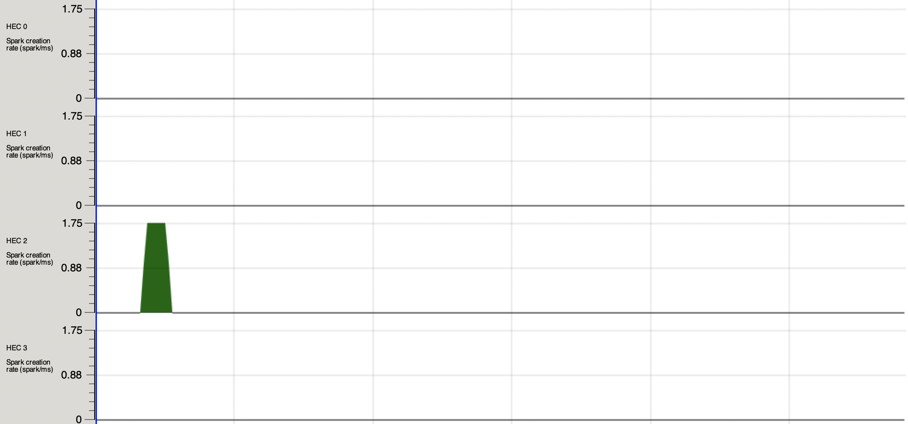
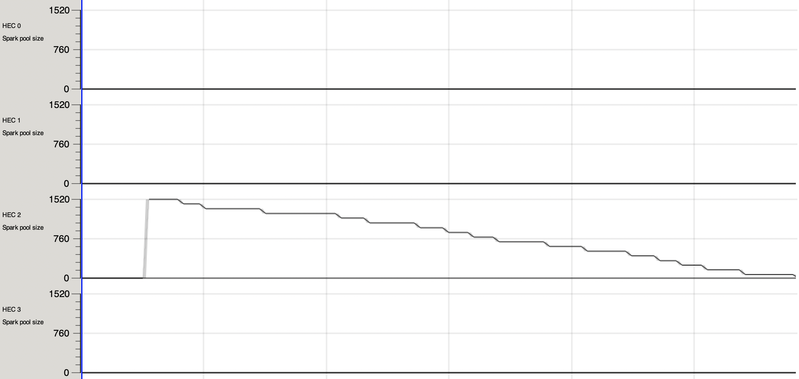
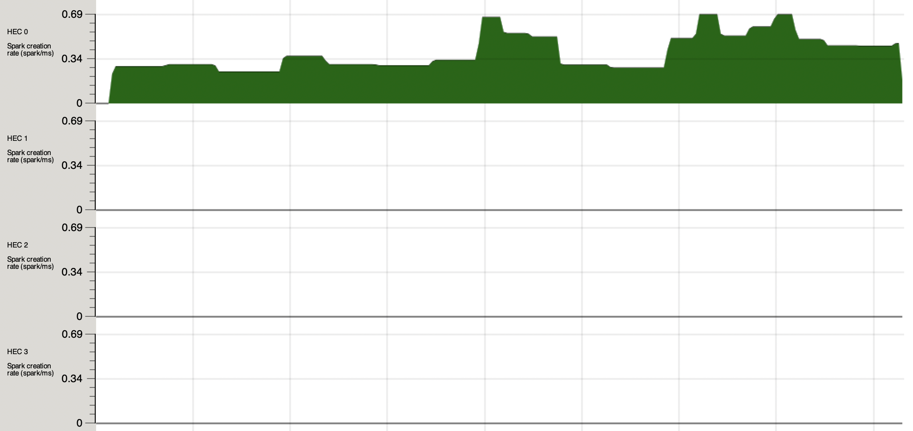
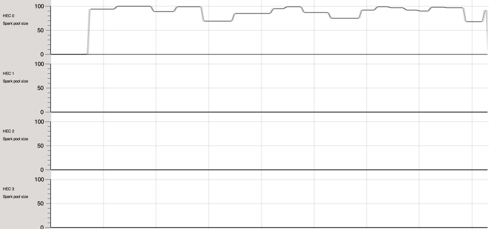
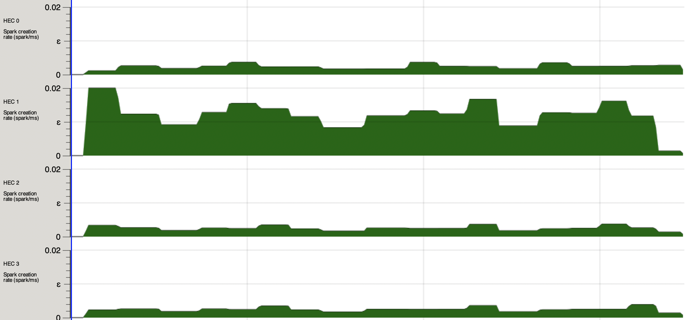
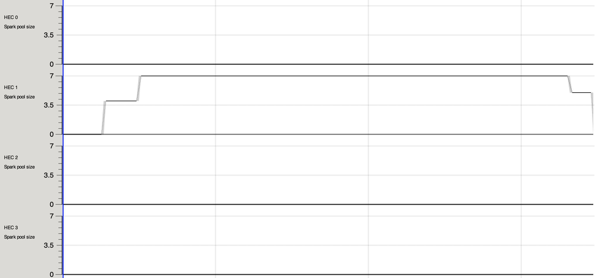

# Laboratory A
Group 4
Predrag Bozhovikj, Erik Sievers

## Assignment 1

Benchmarks on modified function `pJackknife m f` with injected mapping function `m` modified to be parallelised. Benchmarking is run with params `+RTS -A300m -lf -N4 -s`.

Benchmark results for the sequential map.

```
benchmarking map      (sequential)
time                 428.7 ms   (422.7 ms .. 434.4 ms)
                     1.000 R²   (1.000 R² .. 1.000 R²)
mean                 433.8 ms   (431.3 ms .. 435.5 ms)
std dev              2.931 ms   (2.199 ms .. 3.280 ms)
variance introduced by outliers: 19% (moderately inflated)
```

### `pmap`: `par, pseq`

```
benchmarking pmap     (par, pseq)
time                 188.2 ms   (168.4 ms .. 215.6 ms)
                     0.987 R²   (0.969 R² .. 1.000 R²)
mean                 190.4 ms   (184.4 ms .. 198.1 ms)
std dev              9.223 ms   (4.376 ms .. 13.31 ms)
variance introduced by outliers: 14% (moderately inflated)
```

### `rpmap`: `rpar, rseq`

```
benchmarking rpmap    (rpar, rseq)
time                 179.6 ms   (176.6 ms .. 183.5 ms)
                     1.000 R²   (0.999 R² .. 1.000 R²)
mean                 177.4 ms   (176.1 ms .. 178.5 ms)
std dev              1.797 ms   (1.348 ms .. 2.299 ms)
variance introduced by outliers: 12% (moderately inflated)
```

### `chunkMap`: Strategy

Run with strategy `parListChunk 100 rdeepseq`.

```
benchmarking chunkMap (strategies)
time                 183.3 ms   (173.5 ms .. 192.7 ms)
                     0.997 R²   (0.989 R² .. 1.000 R²)
mean                 183.7 ms   (180.4 ms .. 191.0 ms)
std dev              6.352 ms   (1.962 ms .. 9.754 ms)
variance introduced by outliers: 14% (moderately inflated)
```

### Par monad

The implementation of map using parallel monad is in the function `_parMap` which uses a
threshold parameter `t` to divide the list into `t` sublists, returning an `IVar` for each
sublist.

```
benchmarking _parMap  (Par monad)
time                 185.5 ms   (179.4 ms .. 191.1 ms)
                     0.999 R²   (0.999 R² .. 1.000 R²)
mean                 181.2 ms   (179.3 ms .. 183.5 ms)
std dev              2.826 ms   (1.918 ms .. 3.889 ms)
variance introduced by outliers: 14% (moderately inflated)
```

## Assignment 2

Let's first look at the sorting
```
benchmarking divide and conquer sort
time                 1.554 s    (943.7 ms .. 2.768 s)
                     0.934 R²   (0.892 R² .. 1.000 R²)
mean                 1.310 s    (1.209 s .. 1.469 s)
std dev              173.7 ms   (48.20 ms .. 235.1 ms)
variance introduced by outliers: 24% (moderately inflated)

benchmarking built-in sort
time                 990.5 ms   (753.3 ms .. 1.277 s)
                     0.990 R²   (0.968 R² .. 1.000 R²)
mean                 1.013 s    (960.6 ms .. 1.071 s)
std dev              70.11 ms   (23.90 ms .. 95.13 ms)
variance introduced by outliers: 20% (moderately inflated)
```

As we can see, the divide and conquer sort is a bit slower than the standard implementation.

Let's look at the search

```
benchmarking divide and conquer search
time                 183.0 ms   (140.8 ms .. 214.0 ms)
                     0.980 R²   (0.957 R² .. 1.000 R²)
mean                 188.2 ms   (176.7 ms .. 205.3 ms)
std dev              17.31 ms   (9.966 ms .. 27.02 ms)
variance introduced by outliers: 16% (moderately inflated)

benchmarking built-in search
time                 8.108 ms   (7.600 ms .. 8.991 ms)
                     0.887 R²   (0.724 R² .. 0.989 R²)
mean                 8.783 ms   (8.419 ms .. 9.750 ms)
std dev              1.599 ms   (657.9 μs .. 2.855 ms)
variance introduced by outliers: 80% (severely inflated)
```

The search is a lot slower than the default implementation. It may be a good idea to not spark everything, but instead chunk it after a given depth to improve performance.

## Assignment 3
### 3.1 parBuffer

`parBuffer` takes an integer and a strategy as a parameter and then puts that number of sparks in a buffer. Once a spark is done, another can be added.

### 3.2 Compare parListChunk with parBuffer

Let's start by looking at how `parListChunk` creates and consumes sparks from the spark pool

`parListChunk` creates all sparks right away

`parListChunk` then consumes the sparks from the spark pool

Now, let's contrast that with `parBuffer`

`parBuffer`, on the other hand, creates a number of sparks and then creates new sparks as the created ones finish.

`parBuffer` as we can see, the number of sparks is somewhat stable. As sparks are consumed, new sparks are added to the spark pool
### 3.3 Combine chunking with parBuffer

Let's see how our `parBufferChunk` performed



It's similar to `parBuffer` in that it has a somewhat stable number of sparks throughout the whole execution. However, with the parameters we chose (buffer size 10, chunk size 100) the `parBuffer` allocates 16000 sparks, whereas the `barBufferChunk` only allocates 160 sparks. This reduced overhead makes `barBufferChunk` almost twice as fast as `parBuffer` (39s vs 17s).

<!-- Try it out, look at threadscope and explain what's going on -->