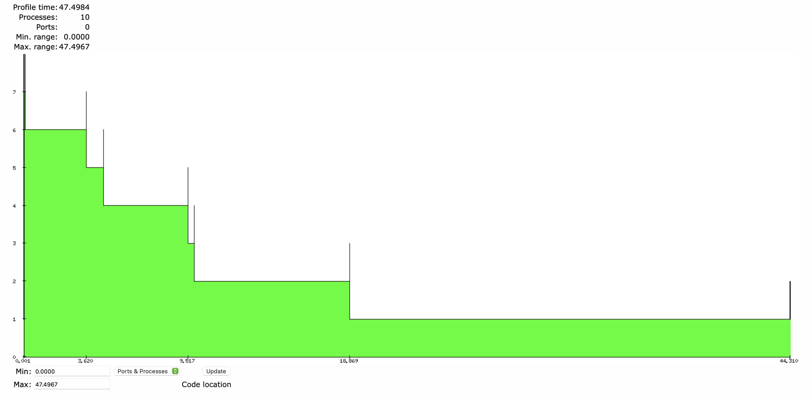
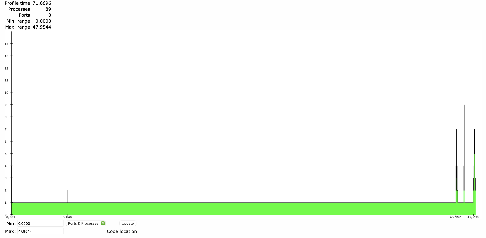
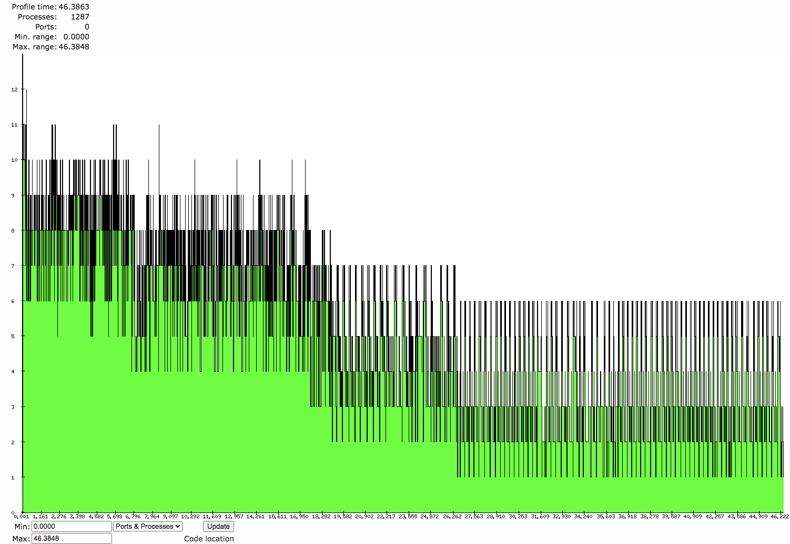

# Laboratory B
Group 4
Predrag Bozhovikj, Erik Sievers

## Part one: parallelising the multiple puzzles

We ran the benchmarks on two different machines: one with an i7 Dual-Core processor and one with an i7 Quad-Core processor.

For 100 benchmark runs, running the benchmark takes 77.02 seconds on the Dual-Core and 81.77 seconds on the quad core. When we parallelize the solving of the various puzzles, the speedup is fairly small: solving the puzzles in parallel takes 47.50s on the dual core and 55s on the quad core. The reason can be found when looking at how long each puzzle takes to solve:
```

i7 Dual-Core
   ====
{77023483,
 [{wildcat,0.42735},
  {diabolical,53.09819},
  {vegard_hanssen,119.4723},
  {challenge,12.75032},
  {challenge1,512.22093},
  {extreme,12.560649999999999},
  {seventeen,59.704879999999996}]}

i7 Quad-Core
   ====
{81769956,
 [{wildcat,0.47587},
  {diabolical,65.51498000000001},
  {vegard_hanssen,139.65792000000002},
  {challenge,11.45117},
  {challenge1,539.63801},
  {extreme,12.84231},
  {seventeen,48.11901}]}
```

As we can see, the challenge1 puzzle is by far the slowest to solve: in fact, it takes longer to solve that puzzle than all other puzzles combined. Analysing using percept confirms this: most processes finish quickly, apart from one.



Contrast this with the sequential implementation that does all work on one thread.



We tried three different approaches to parallelising the solver:
1. Parallelising the refinement of rows using `spawn_link`
2. Parallel search using a worker pool.
3. Parallel search using `spawn_link`
4. Parallelising the calls to `refine` in `guesses` using a worker pool
5. Parallelising the calls to `refine` in `guesses` using `spawn_link`
6. Parallelising the calls to `refine_row` in `refine_rows`

We ran the benchmark with two different computers: one with an i7 Dual-Core processor and one with an i7 Quad-Core processor. Both computers had 16gb of RAM.

|                               Task | Dual-Core | Quad-Core |
| ---------------------------------: | :-------: | :-------: |
|                         Sequential |    77s    |    81s    |
|                  Parallel problems |    48s    |    55s    |
| Parallel search w/ `par:speculate` |    59s    |    41s    |
|    Parallel search w/ `spawn_link` |    89s    |    70s    |
|                     Parallel guess |   115s    |    92s    |
|                    Parallel refine |   ~31m    |   ~38m    |

The best parallelisation opportunity we found (and the only that improved the execution time) was the parallel search using both `par:speculate` and `spawn_link`, which on the dual core processor resulted in a speed-up of 30% and on the quad-core 98%. The other forms of parallelism seem to be too finely granular to be worthwhile and actively worsen the performance.

The benchmark for the parallel refine is approximate. After the benchmark didn't finish for 10 minutes, it was cancelled. Running one execution instead of 100 took 19s and 23s respectively. Multiplying that by 100, we get a rough estimate of 31 minutes and 38 minutes, respectively.

## Part two: comparing performance for parallel search

### Parallel search with `par:speculate`
Parallel search with `par:speculate` uses a worker pool to run function `solve_one/1` in a worker parallel to the main thread - when either the main thread or worker find a solution, DFS search is done and the solver waits to recur back to the first solver function call. To run parallel search with `par:speculate`, run

```erlang
c(par). par:start(). c(sudoku). sudoku:benchmarks_spec().
```

### Parallel search with `spawn_link` splitting the decision tree
Parallel search with `spawn_link` spawns child processes until a given max. depth is reached and the solution is searched then successfully on each process in parallel. If/when a solution is found, the solution is messaged to the main parent process which then kills all child processes and continues execution to the next problem. To run parallel search with `spawn_link`, run

```erlang
c(sudoku). sudoku:benchmarks_par().
```

### Benchmarking

<style>
.final-results tr:nth-child(1) td:nth-child(2) { background: green; color: white; }
.final-results tr:nth-child(1) td:nth-child(3) { background: yellow; color: black; }
.final-results tr:nth-child(1) td:nth-child(4) { background: red; color: white; }

.final-results tr:nth-child(2) td:nth-child(2) { background: red; color: white; }
.final-results tr:nth-child(2) td:nth-child(3) { background: yellow; color: black; }
.final-results tr:nth-child(2) td:nth-child(4) { background: green; color: white; }

.final-results tr:nth-child(3) td:nth-child(2) { background: red; color: white; }
.final-results tr:nth-child(3) td:nth-child(3) { background: yellow; color: black; }
.final-results tr:nth-child(3) td:nth-child(4) { background: green; color: white; }

.final-results tr:nth-child(4) td:nth-child(2) { background: red; color: white; }
.final-results tr:nth-child(4) td:nth-child(3) { background: yellow; color: black; }
.final-results tr:nth-child(4) td:nth-child(4) { background: green; color: white; }

.final-results tr:nth-child(5) td:nth-child(2) { background: red; color: white; }
.final-results tr:nth-child(5) td:nth-child(3) { background: yellow; color: black; }
.final-results tr:nth-child(5) td:nth-child(4) { background: green; color: white; }

.final-results tr:nth-child(6) td:nth-child(2) { background: green; color: white; }
.final-results tr:nth-child(6) td:nth-child(3) { background: yellow; color: black; }
.final-results tr:nth-child(6) td:nth-child(4) { background: red; color: white; }

.final-results tr:nth-child(7) td:nth-child(2) { background: green; color: white; }
.final-results tr:nth-child(7) td:nth-child(3) { background: yellow; color: black; }
.final-results tr:nth-child(7) td:nth-child(4) { background: red; color: white; }

.final-results tr:nth-child(1) td:nth-child(5) { background: green; color: white; }
.final-results tr:nth-child(1) td:nth-child(6) { background: red; color: white; }
.final-results tr:nth-child(1) td:nth-child(7) { background: yellow; color: black; }
.final-results tr:nth-child(2) td:nth-child(5) { background: red; color: white; }
.final-results tr:nth-child(2) td:nth-child(6) { background: yellow; color: black; }
.final-results tr:nth-child(2) td:nth-child(7) { background: green; color: white; }
.final-results tr:nth-child(3) td:nth-child(5) { background: red; color: white; }
.final-results tr:nth-child(3) td:nth-child(6) { background: yellow; color: black; }
.final-results tr:nth-child(3) td:nth-child(7) { background: green; color: white; }
.final-results tr:nth-child(4) td:nth-child(5) { background: yellow; color: black; }
.final-results tr:nth-child(4) td:nth-child(6) { background: red; color: white; }
.final-results tr:nth-child(4) td:nth-child(7) { background: green; color: white; }
.final-results tr:nth-child(5) td:nth-child(5) { background: yellow; color: black; }
.final-results tr:nth-child(5) td:nth-child(6) { background: red; color: white; }
.final-results tr:nth-child(5) td:nth-child(7) { background: green; color: white; }
.final-results tr:nth-child(6) td:nth-child(5) { background: green; color: white; }
.final-results tr:nth-child(6) td:nth-child(6) { background: yellow; color: black; }
.final-results tr:nth-child(6) td:nth-child(7) { background: red; color: white; }
.final-results tr:nth-child(7) td:nth-child(5) { background: yellow; color: black; }
.final-results tr:nth-child(7) td:nth-child(6) { background: green; color: white; }
.final-results tr:nth-child(7) td:nth-child(7) { background: red; color: white; }


</style>
<div style="page-break-after: always; break-after: page;"></div>

<div class="final-results">

|        Problem | Benchmark Quad-Core [*µs*] | | | Time on Dual-Core [*µs*] | | |
|                |    Seq | Par-Spec | Par-Spawn |    Seq | Par-Spec | Par-Spawn |
| :------------- | -----: | -------: | --------: | -----: | -------: | --------: |
| wildcat        |   0.46 |     0.57 |      0.74 |   0.43 |     0.79 |      0.59 |
| diabolical     |  65.51 |    35.32 |     27.46 |  45.83 |    44.93 |     40.54 |
| vegard-hanssen | 139.66 |    96.01 |     58.28 |  98.48 |    89.90 |     84.96 |
| challenge      |  11.45 |     8.47 |      5.70 |   6.66 |     8.28 |      6.09 |
| challenge1     | 539.64 |   300.15 |    247.80 | 368.31 |   385.52 |    236.58 |
| extreme        |  12.84 |    17.47 |     24.80 |  12.56 |    21.67 |     26.38 |
| seventeen      |  48.12 |    53.08 |    341.39 |  44.66 |    41.00 |    491.89 |

</div>

<!-- ### Parallel search worker pool vs `spawn_link`
Worker pool:
```
{51107880,
 [{wildcat,0.5748},
  {diabolical,35.3176},
  {vegard_hanssen,96.00833},
  {challenge,8.47266},
  {challenge1,300.15292999999997},
  {extreme,17.468709999999998},
  {seventeen,53.08332}]}
```

`spawn_link`
```
{70617098,
 [{wildcat,0.74327},
  {diabolical,27.45721},
  {vegard_hanssen,58.28196},
  {challenge,5.69686},
  {challenge1,247.7979},
  {extreme,24.79955},
  {seventeen,341.39387}]}
```

This brings a nice speedup to all problems, except extreme and seventeen which are slower than on the sequential solver. -->

<!-- After implementing worker pools and splitting of the initial decision tree into one process for each, the number of processes jumps drastically without a significant speedup in execution (46.4s), as can be seen in percept. -->
<!--  -->
