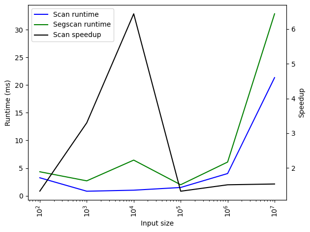

# Lab C
Erik Sievers, Predrag Bozhovikj

---

Due to issues with Mac OS and NVIDIA cards, we were able to run OpenCL benchmarks only on a single machine, namely a Macbook with an integrated GPU. The results are presented below.

## Exercise 1
### Exercise 1.1

No speedup is achieved over the sequential run for this exercise with the OpenCL runtime nearing sequential runtime for bigger input sizes.

### Exercise 1.3

A speedup is achieved over the sequential runtime given $\text{input size} \ge 3 \times 10^6$.

### Exercise 2.1

$$\oplus \text{ is an associative operator with neutral element } 0$$ (1)
$$ (v_1, \, f_1) \oplus^\prime (v_2, \, f_2) = (\text{if } f_2 \text{ then } v_2 \text{ else } v_1 \oplus v_2, \,f_1 \vee f_2)$$ (2)
$$(2) \; \therefore \;\; (0, \, false) \oplus^\prime (v_2, \, true) = (v_2, \, f_1 \vee true) = (v_2, \, true)$$ (3)
$$ (1), \, (2) \; \therefore \;\; (0, \, false) \oplus^\prime (v_2, \, false) = (0 \oplus v_2, \, false \vee false) = (v_2, \, false)$$ (4)
$$ (3), \, (4) \; \therefore \;\; (0, \, false) \oplus^\prime (v_2, \, f_2) = (v_2, \, f_2) \;\;\; \blacksquare$$ (5)

### Exercise 2.2

The standard scan performs better than the segmented scan, but the speedup seems to vary. Looking at the chart, it's unclear if they scale evenly or not. However, since the segmented scan only performs a small amount of extra work for each element it'd be expected that the speedup is consistent across problem sizes.

The standard reduce performs better than the segmented reduce, and the speedup increases with input size. Comparing the previous chart with this one, we can see that scan actually is quite a bit slower than reduce, which makes sense since reduce only needs to produce the output of the last element produced by scan. In our implementation however, we're using scan, which already is going to bring the performance closer to scan than reduce. Furthermore, we perform a couple of unzip and zip operations, a rotate and a filter operation which also adds to the execution time.

## Exercise 3: 2D Ising Model

We ran the ising model benchmarks with four different sizes and three different number of iterations:

|    Size | Iterations | Time OpenCL [*μs*] | Time Sequential [*μs*] |
| ------: | :--------: | :----------------: | :--------------------: |
|   10x10 |     2      |        1499        |           72           |
|   30x30 |     2      |        1456        |          353           |
|   90x90 |     2      |        1393        |          2303          |
| 270x270 |     2      |        2600        |         21281          |
|   10x10 |     20     |        4780        |          385           |
|   30x30 |     20     |        3888        |          2627          |
|   90x90 |     20     |        3026        |         18394          |
| 270x270 |     20     |        8002        |         142951         |
|   10x10 |    200     |       26983        |          2554          |
|   30x30 |    200     |       21323        |         22602          |
|   90x90 |    200     |       22088        |         155655         |
| 270x270 |    200     |       48805        |        1510192         |

The computer used was a Macbook with an integrated GPU.

The first chart is for two iterations. As we can see, even with an integrated GPU the scaling for large problem sizes is impressive. There is a large overhead for using the GPU however.

The second chart is for 20 iterations. The pattern is similar to the one we saw with two iterations. 

The third chart is for 200 iterations. The pattern is yet again similar to the one we saw with two iterations.

The final chart is showing the runtime across all number of iterations for all sizes. Interestingly, across all number of iterations the 10x10 model took longer to compute compared to both the 30x30 and 90x90 model when using OpenCL. OpenCL scales significantly better with regards to problem size for all number of iterations, but it also scales _slightly_ better with regards to the number of iterations compared to the sequential implementation.
